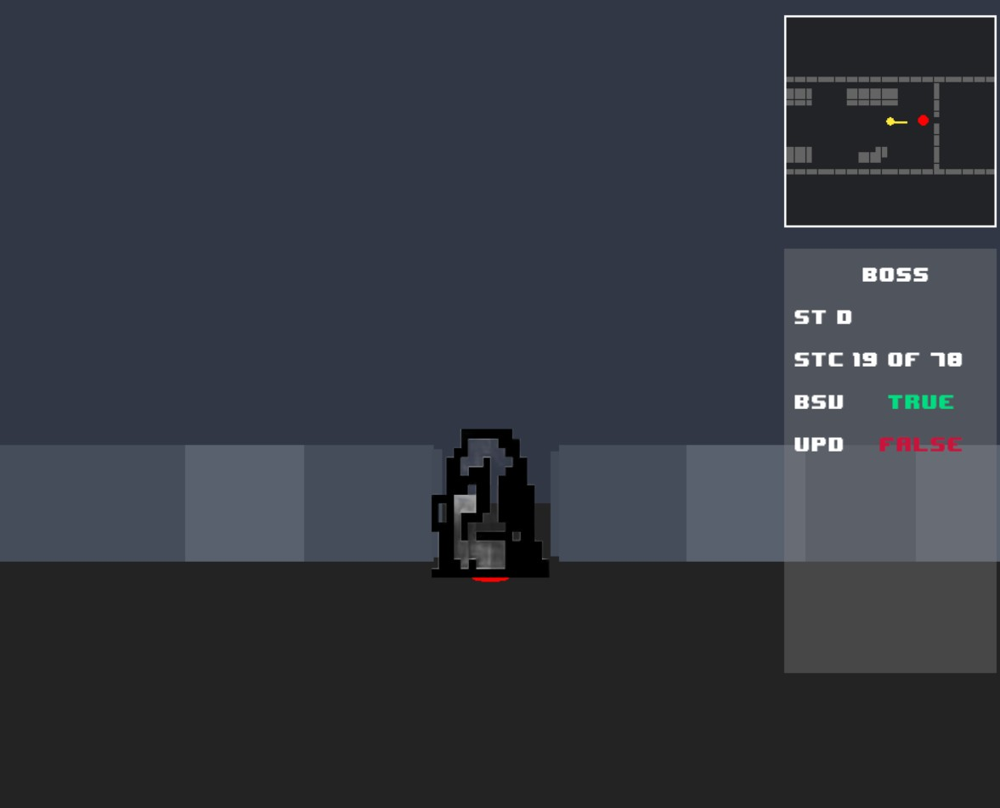
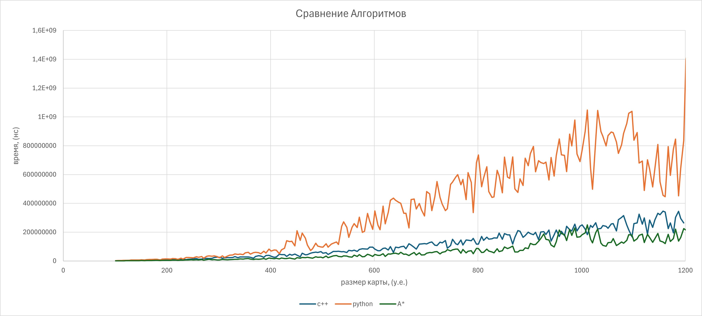
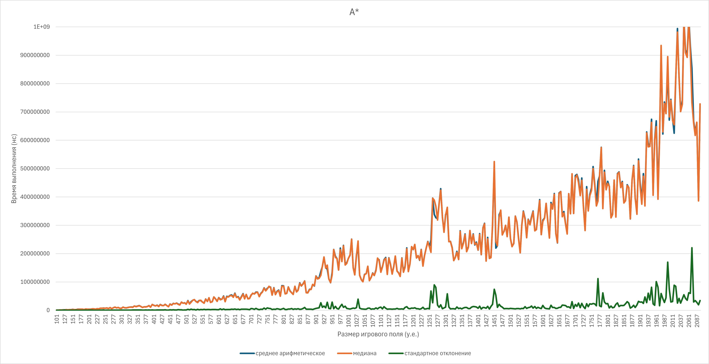
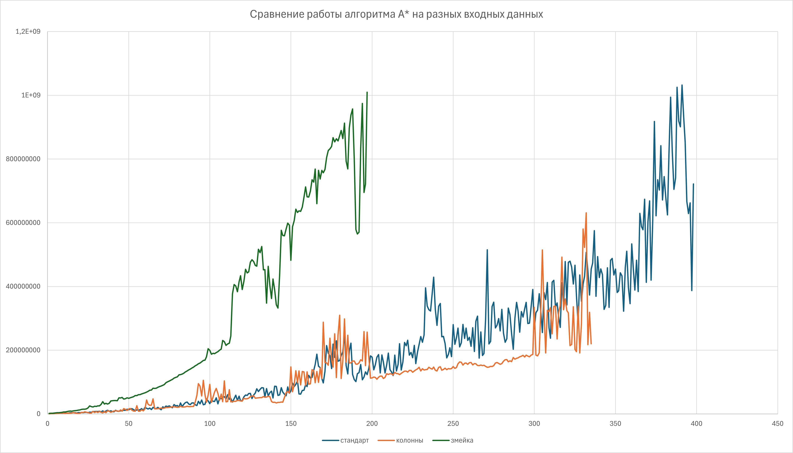
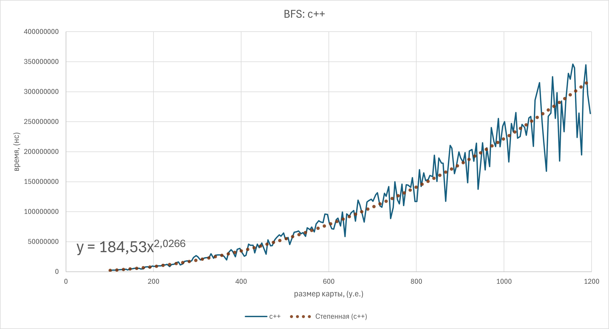
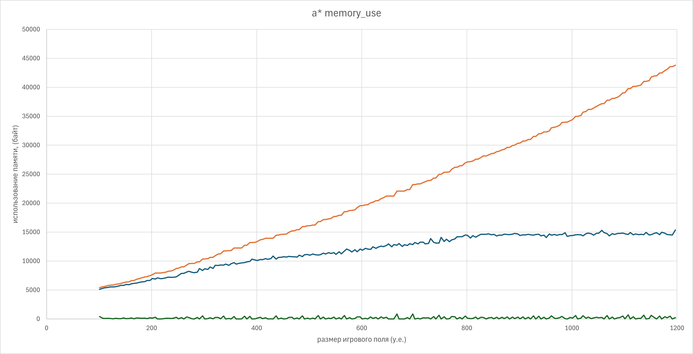
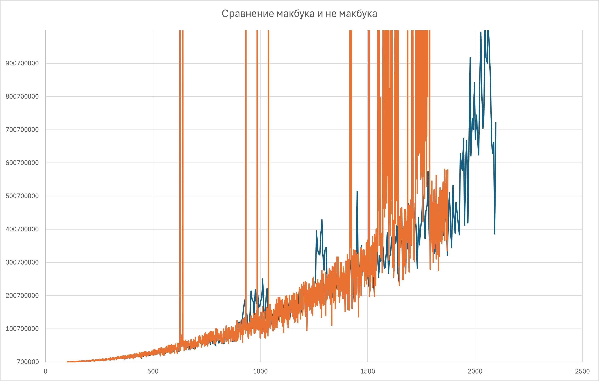

# Применение графовых алгоритмов в играх

Визуализацией данного проекта является игра BossVsPlayer, в которой игроку предстоит убегать от босса в случайно генерируемом лабиринте. Противник двигается по маршруту, рассчитываемому алгоритмом А* или BFS.

## Описание

Игра состоит из четырех файлов:
1. основной (main.py) содержит в себе основную логику игры, функцию генерации карты, основанную на алгоритме DFS,  функцию переключения уровня после завершения текущего, а также функции вывода мини-карты и консоли на экран.
2. файл с драйверами под джойстик (drivers.py) содержит инструкции, необходимые для подключения геймпада, с которого реализовано управление.
3. Библиотека astar_lib.pyd, написанная на языке c++. В библиотеке реализован поиск пути от босса до игрока с использованием алгоритма А* по сетке карты. Библиотека создана на версии python 3.12.4, работа на других версиях не гарантируется.
4. Библиотека algor.py (по умолчанию не используется) - поиск пути с использованием обычного BFS на языке программирования python.
Кроме файлов игры присутствует папка (stats) с исходным кодом библиотеки на c++, excel-файлов с замерами времени работы алгоритма и использованной памяти.

## Структура папок

```
Project/
├── foto/        
│   └── photo_5366311489326750229_x.png                             # текстура босса
├── images                                                                                 # визуализация readme файла
├── music/               
│   ├── horror_music.mp3                                                           # обычная музыка игры
│   └── pogonja.mp3                                                                   # музыка в момент встречи с боссом
├── stats/                                                                                     # статистика по алгоритмам и файлы для ее сбора
│   ├── labgen/
│   │   └── DSU.cpp                                                                       # скрипт, генерирующий лабиринты для теста алгоритмов с использованием непересекающихся множеств
│   ├── 1000 performance mode a-star, dfs gen labirinth.xlsx     # файл с данными тестирования  алгоритма а* на лабиринтах, сгенерированных с использованием DFS
│   ├── bfs.cpp                                                                              # файл с классами A* и BFS
│   ├── astar1.hpp                                                                         # файл с описанием классов A* и BFS
├── dsu_astar_100-2000.xlsx                                                         # файл с данными тестирования A* на лабиринтах, созданным с DSU (системы непересекающихся множеств)
│   └── main.cpp                                                                           # файл с функциями замера времени и памяти
├── 8bitfont.otf                                                                             # шрифт для меню игры
├── algor.py                                                                                  # алгоритм поиска пути с BFS на python
├── astar_lib.pyd                                                                           # библиотека с алгоритмом А* на c++
├── drivers.py                                                                                # библиотека с драйверами для контроллера
├── main.py                                                                                   # основной файл игры
└── README.md
```


## Установка и запуск

%% Важно! библиотека  astar.pyd гарантированно работает только на python 3.12.4! %%

1. Через командную строку зайдите в папку, куда нужно скачать проект
```
cd game
```
2. Скачайте проект в эту папку
```
git clone https://github.com/PerKyyling/BossVsPlayer
```
3. Создание виртуального окружения
```
python -m venv venv
```
4. Активация виртуального окружения
```
call venv\Scripts\activate`
```
5. Установка необходимых библиотек
```
pip install pygame
```
6. Запуск проекта
```
python main.py
```


## Демонстрация проекта

Ссылка на видео с демонстрацией:
[https://vkvideo.ru/video642161178_456239196?list=ln-rFZFd2f3p4XHZ3mbZ3](https://vkvideo.ru/video642161178_456239196?list=ln-rFZFd2f3p4XHZ3mbZ3)



## Технологии

Python 3.12.4, c++ 16.1.0, pygame 2.6.1.

## Выводы

Была разработана игра BossVsPlayer с псевдо-3D графикой. Игра способна принимать от внешней библиотеки инструкции с направлениями движения босса (R, L, U, D). Также в игре реализована мини-карта, визуализирующая текущее положение игрока и босса.

Созданы библиотеки для прокладывания пути с алгоритмами А* и BFS (на c++ и python). Также написаны два алгоритма для генерации карт (с DFS и с DSU). 

Проведено тестирование алгоритмов. Наиболее эффективным оказался А* благодаря эвристике - он разрастается в одном направлении, а не сразу во всех, как алгоритм BFS. Кроме того тесты по времени показали, что python - библиотеки сильно проигрывают аналогам на c++ (в худшем случае python библиотека будет работать более чем в пять раз медленнее).
]

Медиана и среднее арифметическое у алгоритма А* практически полностью совпадают, можно заметить, что в наиболее сложных лабиринтах (на графике они проявляются в всплесках) растет не только среднее время работы, но и стандартное отклонение. При этом А* испытывает более ощутимые всплески на сложных картах, в худшем случае время работы доходит до BFS на C++.
]

На данном графике можно заметить, что простые карты алгоритму даются немного легче средних, однако лабиринты, где есть один маршрут змейкой по спирали А* сильно проседает, время работы быстро растет. На этих данных теряется вся эффективность алгоритма.
]


Для алгоритма BFS на языке c++ было проведено сравнение с теоретической сложностью. В данном случае размер карты - длина и ширина, поэтому количество вершин в среднем растет квадратично относительно этих размеров. Линия тренда растет по степенной, где степень приблизительно равна двум. Реальная сложность алгоритма примерно равна теоретической. 
]

На данном графике представлен тест используемой алгоритмом А* памяти. Пиковое потребление памяти растет линейно, с увеличением графа.  Всплески в памяти отсутствуют
]

Тесты проводились на двух устройствах: ноутбуке на windows и на macbook'e. Можно заметить, что второе устройство выдало несколько пиков из-за перехода в спящий режим, однако на большинстве тестов результаты замера времени одинаковые, причем зачастую windows более подвержен всплескам, не связанным с изменением энергопотребления.
После 1500 тесты на macbook'e выполнялись в фоне, так как про них забыли, устройство многократно переходило в спящий режим. 
]

Алгоритмы поиска маршрута для игры полностью разработаны и протестированы, с ними проблем не возникает. В будущем мы планируем реализовать новые алгоритмы для генерации карт и переработать игру, в первую очередь сделать код более понятным, обернуть в класс. Кроме того мы проведем более обширное тестирование производительности в самой игре, исправим баги.